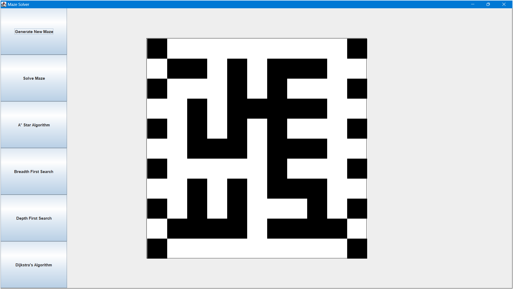
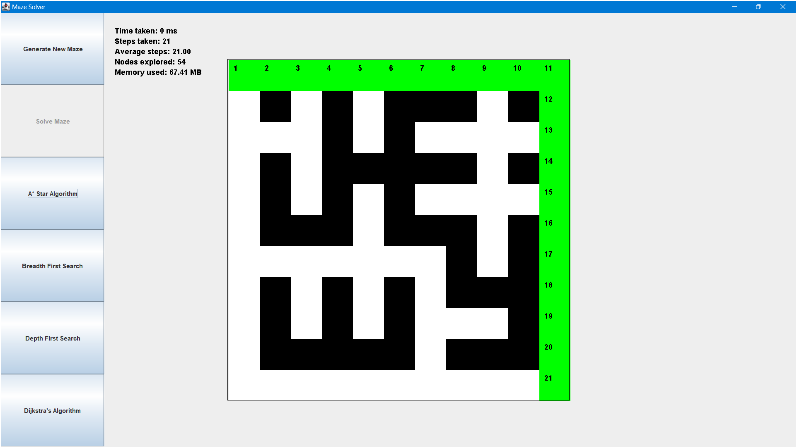
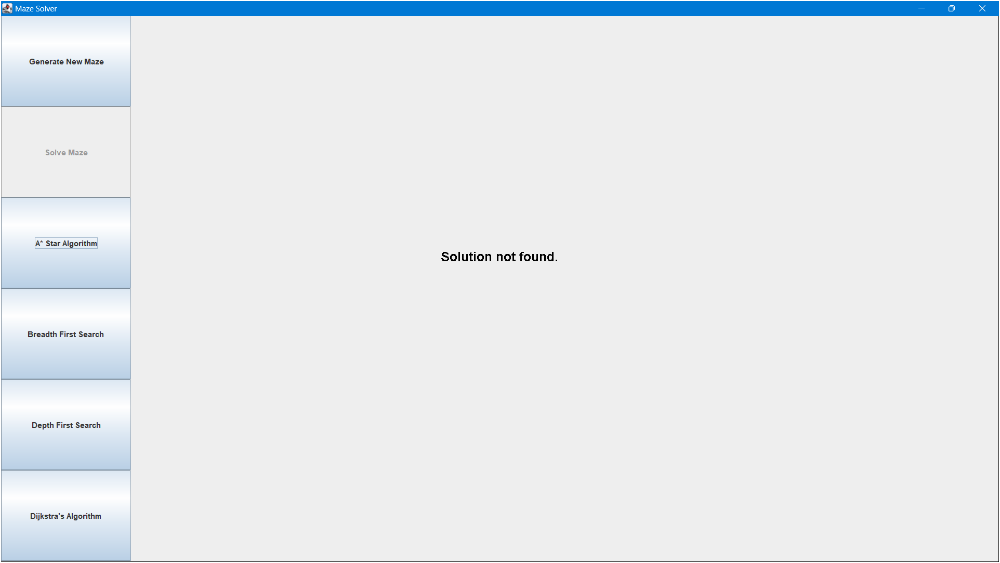

# Maze Solver

This project is a Java-based application that generates and solves mazes using various algorithms. The graphical user
interface (GUI) allows users to generate new mazes and solve them using different algorithms.



## Features

- Generate random mazes
- Solve mazes using different algorithms:
    - A* Star Algorithm
    - Breadth First Search (BFS)
    - Depth First Search (DFS)
    - Dijkstra's Algorithm
- Display metrics such as time taken, steps taken, nodes explored, and memory used




## Requirements

- Java Development Kit (JDK) 8 or higher
- IntelliJ IDEA or any other Java IDE

## Installation

1. Clone the repository:
    ```sh
    git clone https://github.com/Nikhil-818/Maze-Solver.git
    ```
2. Open the project in IntelliJ IDEA or your preferred Java IDE.

## Usage

1. Run the `Maze_GUI` class to start the application.
2. Use the buttons on the left panel to generate a new maze or select an algorithm to solve the maze.
3. The metrics will be displayed after solving the maze.

## Classes

- `Maze_GUI`: The main class for the graphical user interface.
- `Random_Maze_Generator`: Generates random mazes.
- `Solve_Maze_A_Star`: Solves the maze using the A* Star Algorithm.
- `Solve_Maze_BFS`: Solves the maze using Breadth First Search.
- `Solve_Maze_DFS`: Solves the maze using Depth First Search.
- `Solve_Maze_Dijkstra`: Solves the maze using Dijkstra's Algorithm.

## License

This project is licensed under the MIT License. See the `LICENSE` file for details.